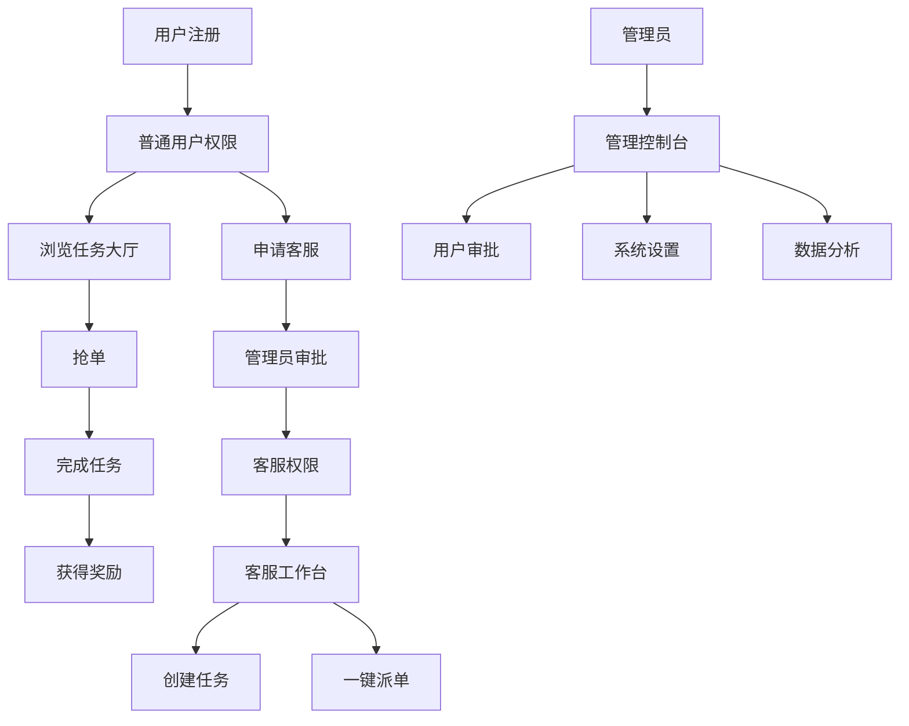

# 三角洲俱乐部抢单系统升级 - 产品需求文档

## 1. 产品概述

三角洲俱乐部抢单系统是一个基于实时任务分发的工作平台，支持任务发布、抢单、派单和管理功能。本次升级将增强UI视觉效果、完善客服管理体系、新增管理端功能，并优化订单处理流程，打造更专业、更高效的任务管理平台。

系统旨在为企业提供灵活的任务分配解决方案，通过严格的权限管理和审批流程，确保平台运营的规范性和安全性。

## 2. 核心功能

### 2.1 用户角色

| 角色 | 注册方式 | 核心权限 |
|------|----------|----------|
| 普通用户 (Worker) | 邮箱注册，默认角色 | 浏览任务、抢单、完成任务、查看个人信息 |
| 客服代表 (CSR) | 申请升级，需管理员审批 | 创建任务、一键派单、管理分配的任务、查看用户信息 |
| 系统管理员 (Admin) | 系统预设或超级管理员指定 | 全系统管理、用户审批、权限设置、数据统计 |

### 2.2 功能模块

本次升级后的系统包含以下主要页面：

1. **首页**: 动态特效展示、系统介绍、快速导航
2. **任务大厅**: 实时任务列表、筛选搜索、抢单功能
3. **我的任务**: 个人任务管理、进度跟踪、收益统计
4. **个人中心**: 用户信息、声誉管理、设置选项
5. **客服工作台**: 任务创建、一键派单、用户管理
6. **管理控制台**: 用户审批、系统设置、数据分析
7. **登录注册**: 用户认证、角色申请

### 2.3 页面详情

| 页面名称 | 模块名称 | 功能描述 |
|----------|----------|----------|
| 首页 | 动态横幅 | 轮播展示、动画特效、系统公告 |
| 首页 | 快速导航 | 角色识别、功能入口、统计概览 |
| 任务大厅 | 任务列表 | 实时更新、状态筛选、分页加载 |
| 任务大厅 | 抢单功能 | 一键抢单、防重复提交、成功反馈 |
| 我的任务 | 任务管理 | 查看已抢任务、完成确认、进度跟踪 |
| 我的任务 | 收益统计 | 收入明细、声誉变化、历史记录 |
| 个人中心 | 用户信息 | 基本资料、角色申请、设置修改 |
| 个人中心 | 声誉系统 | 声誉展示、评级说明、提升建议 |
| 客服工作台 | 任务创建 | 发布新任务、设置奖励、指定截止时间 |
| 客服工作台 | 一键派单 | 选择用户、直接分配、批量操作 |
| 客服工作台 | 用户管理 | 查看用户列表、声誉管理、任务分配历史 |
| 管理控制台 | 用户审批 | 客服申请审批、角色变更、权限管理 |
| 管理控制台 | 系统设置 | 平台参数、奖励规则、公告管理 |
| 管理控制台 | 数据分析 | 用户统计、任务分析、收益报表 |
| 登录注册 | 用户认证 | 邮箱登录、密码重置、记住登录状态 |
| 登录注册 | 角色申请 | 客服申请表单、资质上传、申请状态跟踪 |

## 3. 核心流程

### 普通用户流程
用户注册登录后，可以在任务大厅浏览开放任务，通过抢单获取任务，完成后获得奖励和声誉提升。用户可以在个人中心申请成为客服代表。

### 客服代表流程
客服登录后进入专用工作台，可以创建新任务设置虚拟订单金额，使用一键派单功能直接将任务分配给指定用户，管理自己创建的任务进度。

### 管理员流程
管理员通过控制台审批客服申请，管理用户权限，监控系统运行状态，分析平台数据，设置系统参数。

## 4. 用户界面设计

### 4.1 设计风格

- **主色调**: 深蓝色 (#1e3a8a) 和金色 (#f59e0b)，体现专业性和价值感
- **辅助色**: 灰色系 (#6b7280, #f3f4f6) 用于背景和文字
- **按钮样式**: 圆角设计，渐变背景，悬停动效
- **字体**: 主标题使用 18-24px 粗体，正文使用 14-16px 常规字体
- **布局风格**: 卡片式设计，顶部导航，响应式网格布局
- **图标风格**: 线性图标配合填充图标，统一的视觉语言

### 4.2 页面设计概览

| 页面名称 | 模块名称 | UI元素 |
|----------|----------|---------|
| 首页 | 动态横幅 | 全屏轮播、渐变背景、浮动动画、粒子特效 |
| 首页 | 导航栏 | 透明背景、滚动固定、角色标识、通知徽章 |
| 任务大厅 | 任务卡片 | 阴影效果、悬停放大、状态标签、倒计时动画 |
| 任务大厅 | 筛选器 | 下拉选择、标签切换、搜索框、清除按钮 |
| 客服工作台 | 操作面板 | 分栏布局、快捷按钮、数据图表、实时更新 |
| 客服工作台 | 派单界面 | 用户选择器、拖拽分配、批量操作、确认对话框 |
| 管理控制台 | 审批列表 | 表格展示、状态筛选、批量审批、详情弹窗 |
| 管理控制台 | 数据看板 | 图表展示、实时数据、导出功能、时间筛选 |

### 4.3 响应式设计

系统采用移动优先的响应式设计，支持桌面端、平板和手机端访问。在移动端优化触摸交互，简化操作流程，确保核心功能在小屏幕上的可用性。

