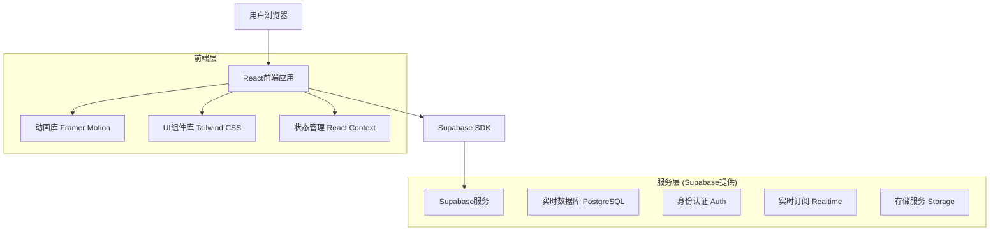
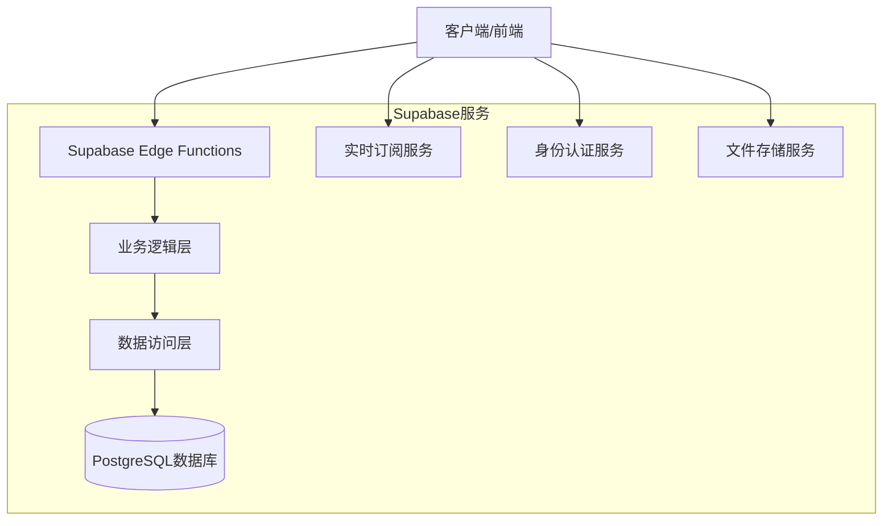
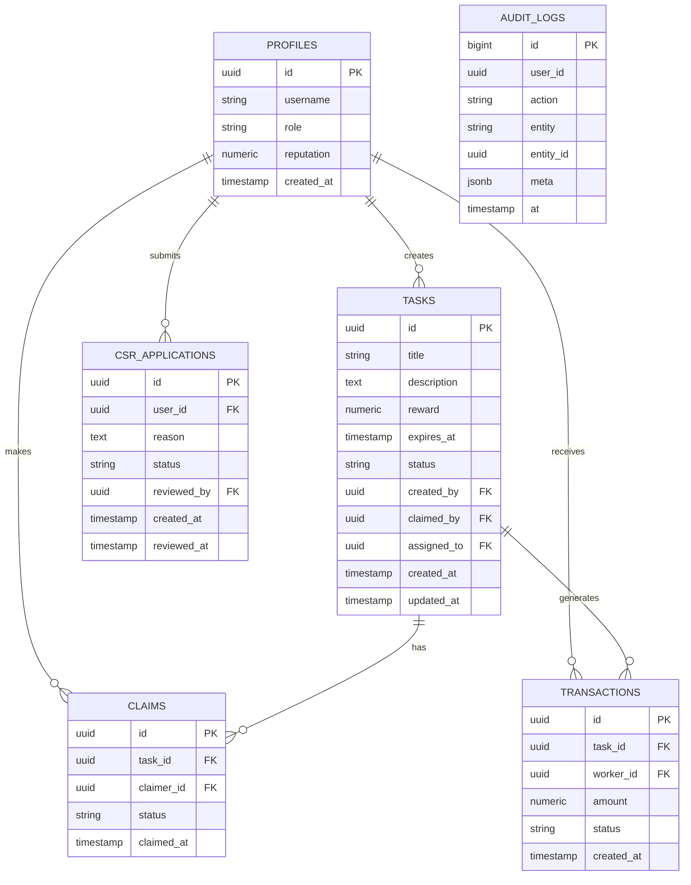

# 三角洲俱乐部抢单系统 - 技术架构文档

## 1. 架构设计



## 2. 技术描述

- **前端**: React@18 + TypeScript + Vite + Tailwind CSS + Framer Motion
- **后端**: Supabase (PostgreSQL + Auth + Realtime + Storage)
- **部署**: EdgeOne CDN + 静态托管

## 3. 路由定义

| 路由 | 用途 |
|------|-----|
| / | 首页，展示系统介绍和动态特效 |
| /auth | 登录注册页面，包含角色申请功能 |
| /hall | 任务大厅，显示可抢任务列表 |
| /my-tasks | 我的任务，个人任务管理 |
| /profile | 个人中心，用户信息和设置 |
| /csr | 客服工作台，任务创建和派单功能 |
| /admin | 管理控制台，用户审批和系统管理 |

## 4. API定义

### 4.1 核心API

**用户认证相关**
```
POST /auth/v1/signup
```

请求:
| 参数名 | 参数类型 | 是否必需 | 描述 |
|--------|----------|----------|------|
| email | string | true | 用户邮箱 |
| password | string | true | 用户密码 |
| username | string | true | 用户名 |

响应:
| 参数名 | 参数类型 | 描述 |
|--------|----------|------|
| user | object | 用户信息对象 |
| session | object | 会话信息 |

**任务管理相关**
```
POST /rest/v1/rpc/claim_task
```

请求:
| 参数名 | 参数类型 | 是否必需 | 描述 |
|--------|----------|----------|------|
| p_task_id | uuid | true | 任务ID |

响应:
| 参数名 | 参数类型 | 描述 |
|--------|----------|------|
| status | string | 操作状态 (success/error) |
| task_id | uuid | 任务ID |
| reason | string | 错误原因 (如果失败) |

**一键派单功能**
```
POST /rest/v1/rpc/assign_task_to_user
```

请求:
| 参数名 | 参数类型 | 是否必需 | 描述 |
|--------|----------|----------|------|
| p_task_id | uuid | true | 任务ID |
| p_user_id | uuid | true | 目标用户ID |

**客服申请审批**
```
POST /rest/v1/rpc/approve_csr_application
```

请求:
| 参数名 | 参数类型 | 是否必需 | 描述 |
|--------|----------|----------|------|
| p_user_id | uuid | true | 申请用户ID |
| p_approved | boolean | true | 是否批准 |

示例:
```json
{
  "p_user_id": "123e4567-e89b-12d3-a456-426614174000",
  "p_approved": true
}
```

## 5. 服务器架构图



## 6. 数据模型

### 6.1 数据模型定义



### 6.2 数据定义语言

**用户档案表 (profiles)**
```sql
-- 已存在，新增字段
ALTER TABLE public.profiles ADD COLUMN IF NOT EXISTS avatar_url TEXT;
ALTER TABLE public.profiles ADD COLUMN IF NOT EXISTS phone VARCHAR(20);
ALTER TABLE public.profiles ADD COLUMN IF NOT EXISTS last_login TIMESTAMP WITH TIME ZONE;

-- 创建索引
CREATE INDEX IF NOT EXISTS idx_profiles_role ON public.profiles(role);
CREATE INDEX IF NOT EXISTS idx_profiles_reputation ON public.profiles(reputation DESC);
```

**客服申请表 (csr_applications)**
```sql
-- 创建表
CREATE TABLE IF NOT EXISTS public.csr_applications (
    id UUID PRIMARY KEY DEFAULT gen_random_uuid(),
    user_id UUID NOT NULL REFERENCES auth.users(id) ON DELETE CASCADE,
    reason TEXT NOT NULL,
    experience TEXT,
    contact_info JSONB,
    status TEXT NOT NULL CHECK (status IN ('pending', 'approved', 'rejected')) DEFAULT 'pending',
    reviewed_by UUID REFERENCES auth.users(id),
    admin_notes TEXT,
    created_at TIMESTAMP WITH TIME ZONE NOT NULL DEFAULT NOW(),
    reviewed_at TIMESTAMP WITH TIME ZONE
);

-- 创建索引
CREATE INDEX IF NOT EXISTS idx_csr_applications_user_id ON public.csr_applications(user_id);
CREATE INDEX IF NOT EXISTS idx_csr_applications_status ON public.csr_applications(status);
CREATE INDEX IF NOT EXISTS idx_csr_applications_created_at ON public.csr_applications(created_at DESC);

-- 权限设置
ALTER TABLE public.csr_applications ENABLE ROW LEVEL SECURITY;

-- 用户可以查看自己的申请
CREATE POLICY csr_applications_read_own ON public.csr_applications
FOR SELECT USING (auth.uid() = user_id);

-- 用户可以创建申请
CREATE POLICY csr_applications_insert_own ON public.csr_applications
FOR INSERT WITH CHECK (auth.uid() = user_id);

-- 管理员可以查看和更新所有申请
CREATE POLICY csr_applications_admin_all ON public.csr_applications
FOR ALL USING (
    EXISTS(SELECT 1 FROM public.profiles p WHERE p.id = auth.uid() AND p.role = 'admin')
);
```

**系统设置表 (system_settings)**
```sql
-- 创建表
CREATE TABLE IF NOT EXISTS public.system_settings (
    id UUID PRIMARY KEY DEFAULT gen_random_uuid(),
    key VARCHAR(100) UNIQUE NOT NULL,
    value JSONB NOT NULL,
    description TEXT,
    updated_by UUID REFERENCES auth.users(id),
    updated_at TIMESTAMP WITH TIME ZONE NOT NULL DEFAULT NOW()
);

-- 初始数据
INSERT INTO public.system_settings (key, value, description) VALUES
('task_reward_range', '{"min": 10, "max": 1000}', '任务奖励金额范围'),
('reputation_rules', '{"complete_bonus": 3, "cancel_penalty": 5}', '声誉计算规则'),
('platform_commission', '{"rate": 0.05}', '平台佣金比例'),
('auto_assign_enabled', 'true', '是否启用自动分配'),
('max_concurrent_tasks', '5', '用户最大并发任务数')
ON CONFLICT (key) DO NOTHING;
```

**一键派单功能存储过程**
```sql
-- 一键派单功能
CREATE OR REPLACE FUNCTION public.assign_task_to_user(p_task_id UUID, p_user_id UUID)
RETURNS JSON LANGUAGE plpgsql SECURITY DEFINER SET search_path = public AS $$
DECLARE 
    t public.tasks%rowtype;
    target_user public.profiles%rowtype;
    current_user_role TEXT;
BEGIN
    -- 检查当前用户权限
    SELECT role INTO current_user_role FROM public.profiles WHERE id = auth.uid();
    IF current_user_role NOT IN ('csr', 'admin') THEN
        RETURN json_build_object('status', 'error', 'reason', 'insufficient_permissions');
    END IF;
    
    -- 检查目标用户是否存在且为worker
    SELECT * INTO target_user FROM public.profiles WHERE id = p_user_id AND role = 'worker';
    IF NOT FOUND THEN
        RETURN json_build_object('status', 'error', 'reason', 'invalid_target_user');
    END IF;
    
    -- 检查任务是否可分配
    SELECT * INTO t FROM public.tasks WHERE id = p_task_id AND status = 'open';
    IF NOT FOUND THEN
        RETURN json_build_object('status', 'error', 'reason', 'task_unavailable');
    END IF;
    
    -- 执行分配
    UPDATE public.tasks 
    SET status = 'assigned', 
        assigned_to = p_user_id, 
        updated_at = NOW()
    WHERE id = p_task_id;
    
    -- 记录审计日志
    INSERT INTO public.audit_logs(user_id, action, entity, entity_id, meta)
    VALUES (auth.uid(), 'assign', 'tasks', p_task_id, 
            json_build_object('assigned_to', p_user_id, 'method', 'direct_assign'));
    
    RETURN json_build_object('status', 'success', 'task_id', p_task_id, 'assigned_to', p_user_id);
END;$$;

-- 客服申请审批功能
CREATE OR REPLACE FUNCTION public.approve_csr_application(p_application_id UUID, p_approved BOOLEAN, p_notes TEXT DEFAULT NULL)
RETURNS JSON LANGUAGE plpgsql SECURITY DEFINER SET search_path = public AS $$
DECLARE 
    app public.csr_applications%rowtype;
    current_user_role TEXT;
BEGIN
    -- 检查管理员权限
    SELECT role INTO current_user_role FROM public.profiles WHERE id = auth.uid();
    IF current_user_role != 'admin' THEN
        RETURN json_build_object('status', 'error', 'reason', 'admin_only');
    END IF;
    
    -- 获取申请信息
    SELECT * INTO app FROM public.csr_applications WHERE id = p_application_id AND status = 'pending';
    IF NOT FOUND THEN
        RETURN json_build_object('status', 'error', 'reason', 'application_not_found');
    END IF;
    
    -- 更新申请状态
    UPDATE public.csr_applications 
    SET status = CASE WHEN p_approved THEN 'approved' ELSE 'rejected' END,
        reviewed_by = auth.uid(),
        reviewed_at = NOW(),
        admin_notes = p_notes
    WHERE id = p_application_id;
    
    -- 如果批准，更新用户角色
    IF p_approved THEN
        UPDATE public.profiles SET role = 'csr' WHERE id = app.user_id;
    END IF;
    
    -- 记录审计日志
    INSERT INTO public.audit_logs(user_id, action, entity, entity_id, meta)
    VALUES (auth.uid(), 'review_application', 'csr_applications', p_application_id,
            json_build_object('approved', p_approved, 'applicant', app.user_id));
    
    RETURN json_build_object('status', 'success', 'approved', p_approved);
END;$$;
```